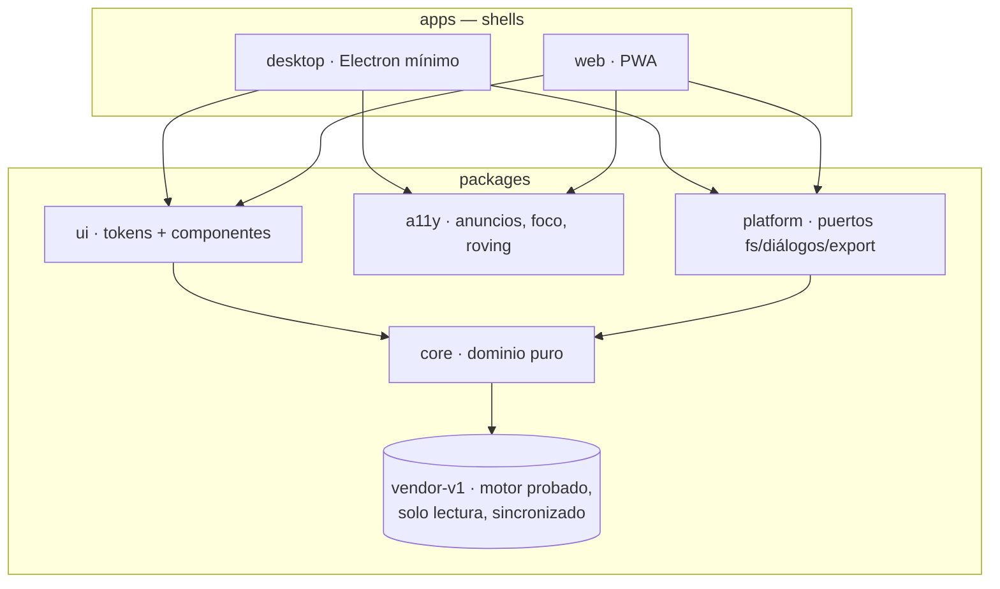

# Arquitectura — CAPYCHAD 2.0

## El diagrama



## Reglas de dependencia (no negociables)

1. **`core` es puro.** Sin `document`, sin `window` (salvo guards de export UMD), sin `electron`.
   Todo lo que toca el mundo exterior entra por `platform` (puertos) o vive en `apps`.
2. **`vendor-v1` es de solo lectura.** Lo escribe `tools/sync-from-v1.js` con checksums
   (MANIFEST.json). Los cambios se hacen en la v1 — que tiene la suite de 30 tests — y se re-sincronizan.
3. **Los shells son tontos.** `apps/desktop` y `apps/web` solo cablean puertos y montan la UI.
   Si un shell acumula lógica, esa lógica se muda a un paquete.
4. **La accesibilidad es un paquete, no un parche.** `a11y` se testea en Node puro (announcer,
   roving) y toda UI nueva lo consume — el estándar NVDA de la v1 es el piso, no el techo.
5. **Un solo sistema de diseño.** `ui/tokens.css` se deriva de `FABLE/app/docs/design.md`
   (la fuente de verdad); los 9 skins entran por el mismo mecanismo `[data-skin]`.

## Decisiones (y por qué)

- **Monorepo npm workspaces, sin framework:** la v1 demostró que vanilla + patrones ARIA
  correctos gana en accesibilidad y en control; un framework re-introduciría el riesgo que
  el estrangulador quiere evitar.
- **CommonJS en core:** compatibilidad directa con el motor v1 y con los tests estilo v1;
  esbuild lo bundlea a IIFE para los shells sin tocar el código.
- **Electron para desktop, File System Access para web:** el mismo contrato (`ports.js`)
  con dos adaptadores — la escalera Windows → Mac → web/Android usa este único punto de cambio.
- **Seguridad heredada de la v1:** contextIsolation, sandbox, permisos denegados, CSP estricta.
  El shell nuevo nace con las reglas que la v1 aprendió con su auditoría.
```
